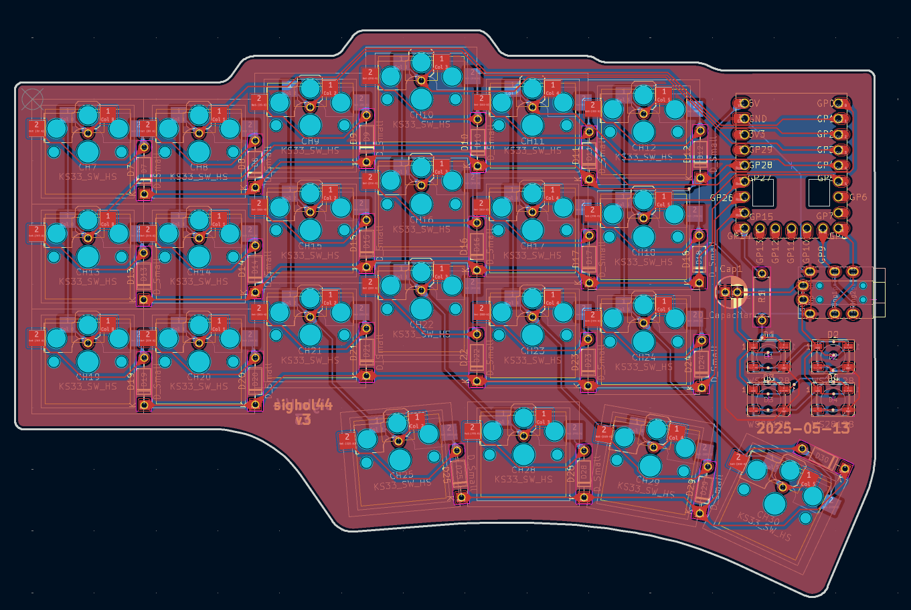

# Sighol-44 v3

# Installation

Install both `kicad` and `kicad-library` from the OS package repository.

Remember to add the [marbastlib](https://github.com/ebastler/marbastlib) symbol and footprints library.
Check the github page for installation instructions.

Also install the `Fabrication toolkit` from the official KiCad repository.
Search for `JLC` in the plugins tab.

# Inkscape edge cut tutorial

## Export SVG from KiCad
- In KiCad, *File* -> *Print*
- Select the Fab, Silkscreen, and User.Drawings layers.
- Then print as SVG

## Convert SVG to Bitmap to make it easier to work with. (optional)
- Open the SVG in inkscape.
- Open Edit ->, Preference, and select the *Imported Images* tab.
- Change the Craete resolution to about 500 dpi and close the preferences window.
- Then select (S) the white background and delete it.
- Then select (S) everything else.
- Click on Edit -> Make a Bitmap copy.
- Then move the bitmap copy to the center of the screen and delete all the other paths

Another alternative is to create a new layer, and move all the paths into this layer.
Snapping will work better when drawing the initial bezier curve, but I don't think it is worth it.

## Draw outline

- Use the **Pen Tool** (B) to draw an outline around the board. Use straight lines.b
- Hold down CTRL to draw straight lines.
- Move around the canvas by holding down the middle mouse button.
- After you have completed the outline, you can use the Node Tool (N) to delete nodes that are redundant. Select the node and use the **Delete** key.
- Delete bezier curve handles by holding control and left clicking on them.
- Add bezier curve handles by holding control and left clicking on a node.
- Double click on the curve to add a new node.
- Show the bezier handles by toggling a button to the right of the X and Y text boxes.
- The X and Y text boxes can also be used to place the nodes.

## Path effects
- Make sure none of the nodes have bezier curve handles.
- First create an offset of around 1mm.
- Then create a corner of around 1mm.
- Then you can customize the corners using the Node Tool (N).
- Make sure the radiuses you customize are symmetric and equal. You _will_ notice.
- For the thumb keys, it is best to have the biggest possible radius (to the center of the switch).

## Exporting SVG for KiCad

- File -> Export (Ctrl+Shift+E)
- Select the output directory and file. Should be `output_export.svg`.
- Toggle **Export Selected Only**.
- Select the outline (S).
- Click on the **Export** button.

## Import into KiCad

- File -> Import -> Graphics
- Use Import scale 1.33 and set layer to Edge.Cuts, and click OK.
- It is useful to select the outline and press M to move it around using the arrow keys. Press ENTER to confirm.
- You will have to iterate. If you create a big fill zone (select F.Cu and fill with ground), and then fill with **B**, you can use that as a guide when deleting and adding back the new edge cut.
- Alternatively, after placing it, notice

It is easy to place the new export on the of the previous export and then delete the previous, for placement.

## Tips and tricks with design

- The bigger the outline, the easier it will be to place rubber feet so that it doesn't wobble.
- Place the grid on the top-left key. `Place` -> `Grid`.
- Guideline: Horizontal traces are blue. Vertical traces are red.
- In **PCB Editor**:
    - F8 to apply from schematics
    - B to build fill zones.
    - Ctrl+Shift+F to import graphics.
    - Top Copper **PgUp**
    - Bottom Copper **PgDown**
    - V: Toggle top and bottom copper layer
    - Tools -> Update Footprints from Library: Take them all!
